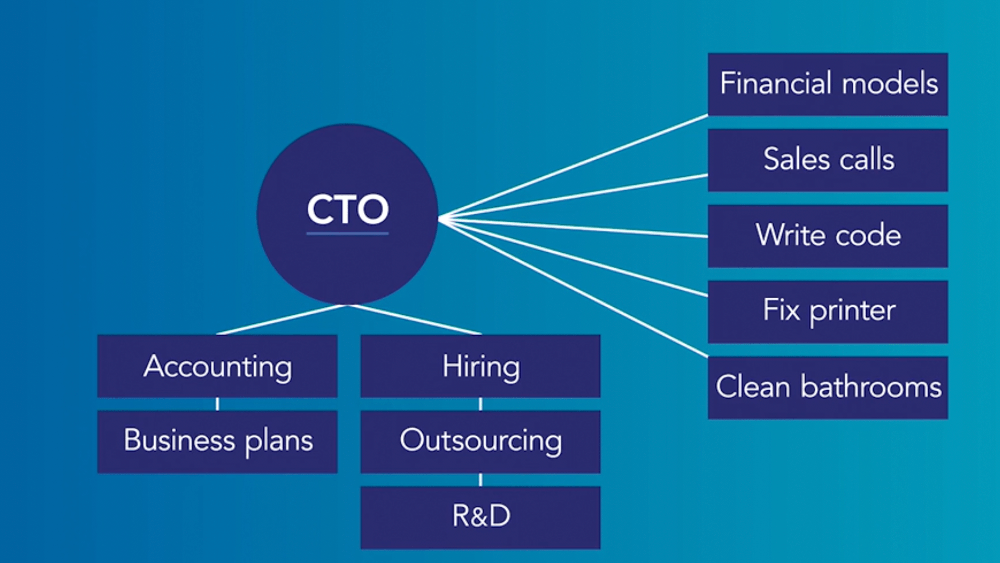

# Intro

- I am the CTO of Propellor where I am responsible for building serverless
application for our analytics engine propellor.ai. We use around 42+ AWS services to keep our system up and running.
I am a certified AWS solution architect as well.

- Prior to that I worked as a Data Scientist at Thinkbumblebee Analytics (parent company of propellor)
where I worked on 16+ different data science project in different domain industries such QSR, IoT, Social media and Retail.

- I also worked as a product manager and associate engineer at Stratfit where I learned product development and algoritm development
 for real use cases like fitness tracking and prediction.

- Images below summarize my role in a nutshell. Scary but true

 

# Currently

I am the CTO of Propellor.ai where I am responsible for Building technology capabilities, platforms and products for the Company. My major responsiblities include

## Platform and Product responsibilites

- Oversee the day-to-day engineering efforts of the company targeted towards
building capabilities, platforms and products for ThinkBumblebee. This includes all the development efforts involved in the development of PROPELLOR.
- Provide technical options to the delivery team in terms of technology, methodology,
algorithms and tools
- Be the Go-To person for all technical advice to the delivery team and the
product/platform team
- Develop the capability to digest the changing business needs of the company,
analyse the costs of each possible approach and do the due diligence of the selected
option
- Lead the due diligence of all technology investments of the company
- Lead the decisions on selection of different kinds of technologies, platforms,
algorithms and analytics/technology products.

[dheeraj site](https://dheerajinampudi.com/)

## Hiring engineers, developers and data scientists

Spearhead hiring, on-boarding, training, and mentoring new technical hires in the company.

## Enterprise security

- Ensure the enterprise security of Thinkbumblebee. The overall responsibility of securing and
protecting all the technical assets, data, Intellectual Property, product documentation,
workflow security (including emails, website, slack etc.), security of storage of company data
across third party apps including (but not limited to) Dropbox, Google Drive, Microsoft One
- Drive and or any other storage used across the company.

## Enterprise architecture

- Ensuring a scalable and future ready centrally planned architecture for the Company’s
platforms and products.
- Develop a second line of engineers who can eventually manage the architecture.

## Quality Assurance

Put together bug testing, validation and overall quality assurance process across the
company.

## DevOps

- Spearhead the DevOps in the company. Set up a practice across the organisation that
automates the development processes across various teams in order to enable them to
build, test, and release software/products/platforms faster and in a more reliable way.
- Gradually build a DevOps function in the company, mentor, nurture and grow the function.

## Technology Partnerships

- Develop Technology partnerships e.g. AWS, Domo, Segment, Databricks et al. Drive the
adoption of new technology across the Company. Leverage these relationships in building
new capabilities within the company.

## I like

- Running
- Skiing
- Sailing and the sea
- Space
- Summer
- [Books](https://www.goodreads.com/dheerajinampudi)

## Origin

- I am from Tanuku, Andhra Pradesh, India

## Fun facts

- I have a list of thousands of ideas, like creating matching bow ties for cats and humans.

## I dream of

- always finding inspiration.
- enabling a brighter future.
- doing better.
- you not checking the commit history for earlier drafts of this file.

## Websites from people I admire

- [Alex Peysakhovich](http://alexpeys.github.io/)

If we are friends and you feel like you belong on this list, you're probably right. I'm sorry I forgot about you. Pester me and I'll add you.
